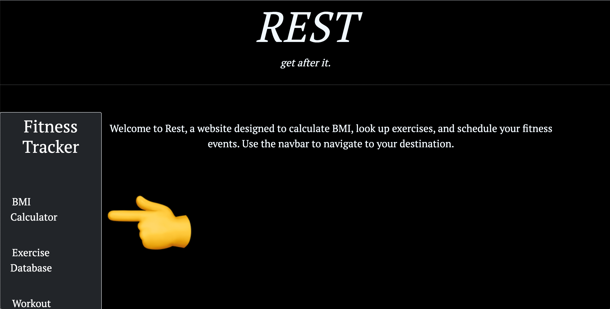
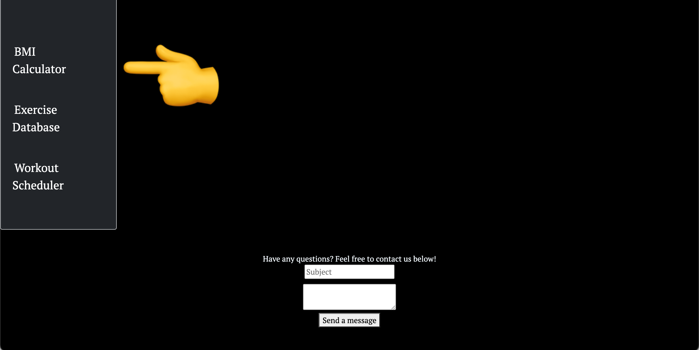
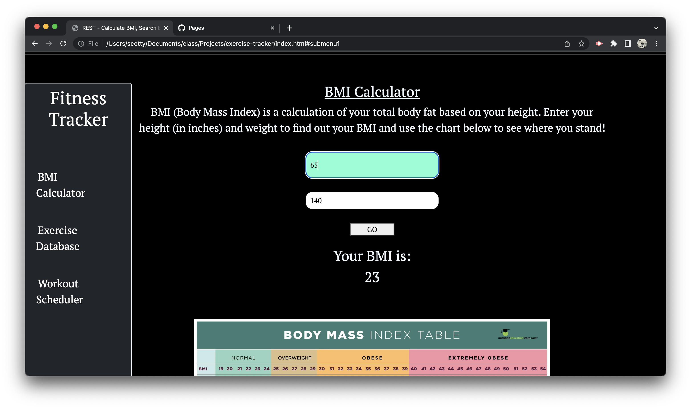
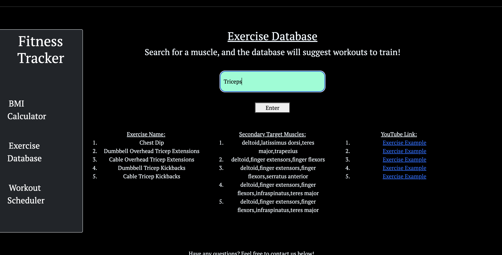
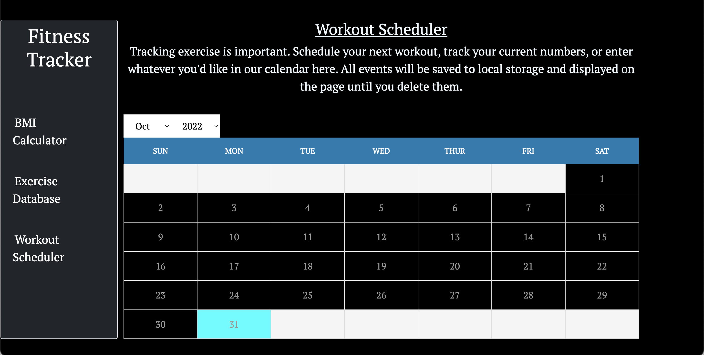
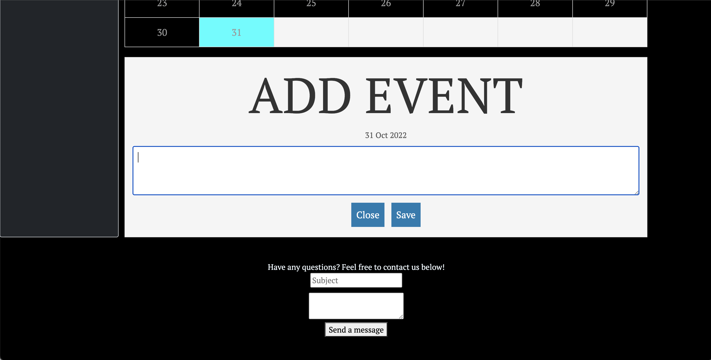

# Exercise-Tracker
Welcome to Rest, a website designed to calculate BMI, look up exercises, and schedule your fitness events

## Creators

-  A-Frankhouser  
-  baumerc10 
-  julianbenchimol 
-  ScottsC0de

## Description

This project was created to allow users to track key fitness aspects as well as demonstrate many different web development technologies. These technologies include: HTML, CSS, BootStrap, jQuery, Web APIs, Server-Side APIs, Local Storage, GitHub Collaborative Repositories, and GitHub Pages. Basic HTML and CSS were used first to create a simple layout. Bootstrap was then used to add the sidebar and positioning. We added 3 links to the side bar. All of the project's functioning was made with jQuery. 2 Server-Side APIs were used to gather data for the BMI Calculator and Exercise Database (See "References" below). Events added to the Workout Scheduler calendar are saved in the browser using Local Storage and will stay displayed even after refresh. All changes were committed and saved onto GitHub Repositories and the site was deployed using GitHub Pages.

## Usage 

Upon clicking the link to the webpage (see "Links" below), the user will be directed to a website with a sidebar to the left. There are three links within the sidebar: A BMI Calculator, Exercise Database, and Workout Scheduler. Clicking the BMI Scheduler will take you to an input form where you will be instructed to add your height and weight. This will then display your calculated BMI. Use the chart below to see where your numbers stand. Next link on the sidebar, the Exercise Database, will direct you to another form input. Here, you can type in an exercise and a description, the muscles worked, and equipment used for that exercise will be displayed. Lastly, the Workout Scheduler link on the sidebar will direct you to an interactive calendar where you can set the month and add events by clicking on a date. The present day is colored in light blue. An "Add Event" form will pop up where you can add, edit, and delete events. These will be saved to your browser's Local Storage and will stay displayed on the page until you delete them. At the bottom of the page, you will see a footer where you can ask the developers any questions you may have about the app.

## Links

Website URL: https://scottsc0de.github.io/exercise-tracker/

GitHub URL: https://github.com/ScottsC0de/exercise-tracker

## Screenshots

## References

This project was completed with a team of amazing people that include Julian Benchimol, Scott George, Cody Kirschbaum, and Alex Frankhouser. Each person played a key role while also bringing a unique idea and perspectives to the table.
